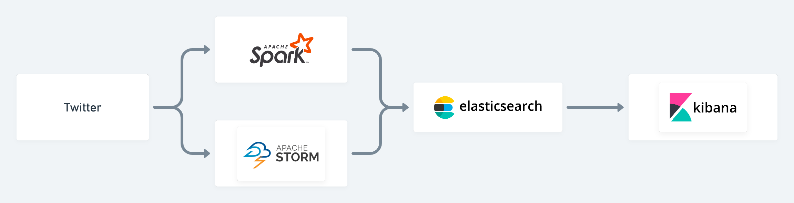
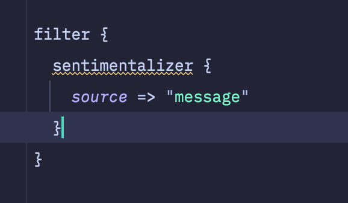
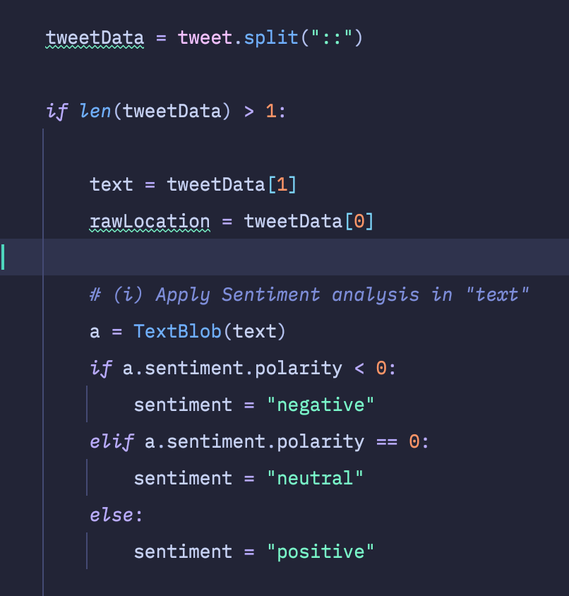
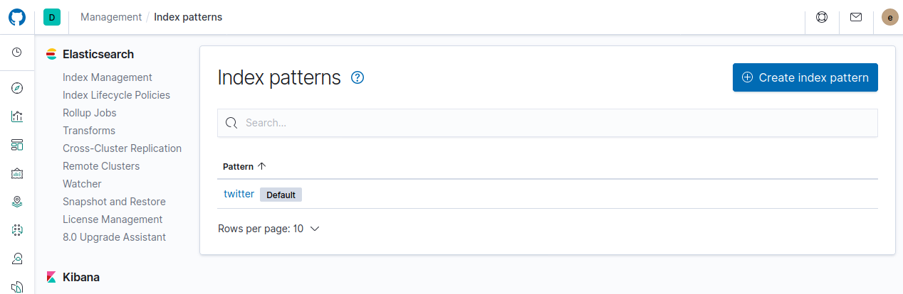
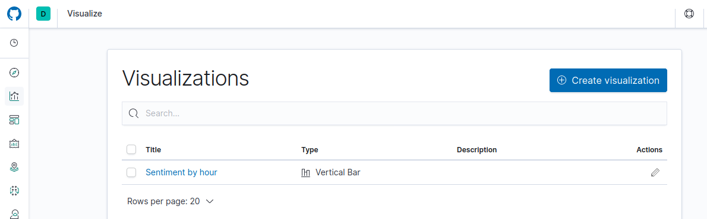
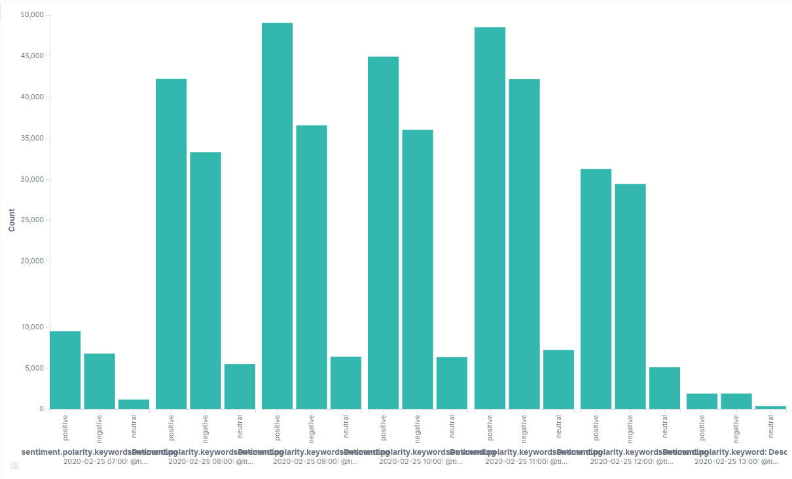
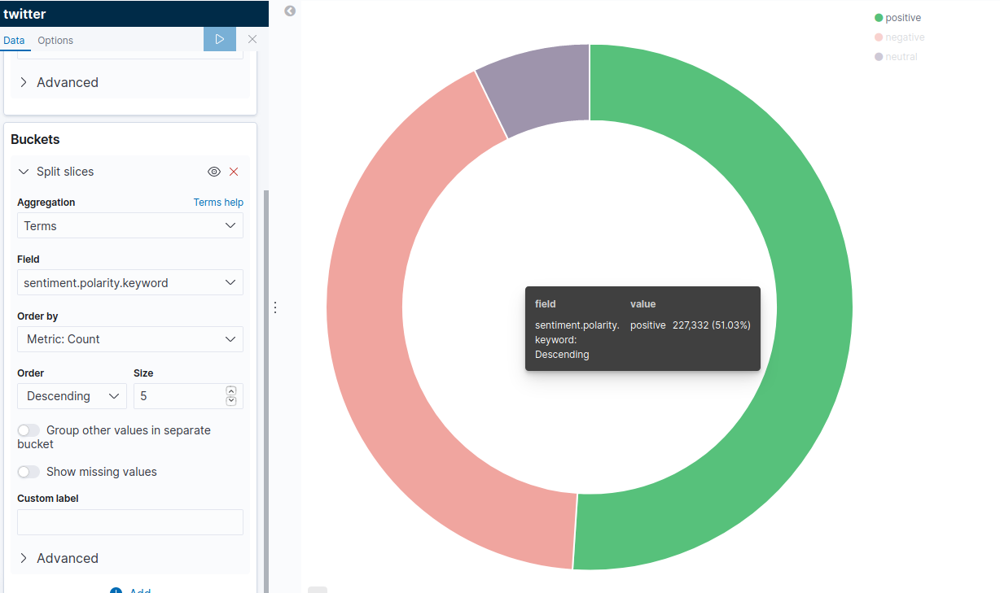

# Twitter Sentiment Analysis With Elasticache, Kibana, Logstash, Spark and Python

This project is an assignment for the Big Data Analytics class. It involves the use of Elasticache, Spark, Logstache and Kibana to perform sentiment analysis on data gathered from Twitter.

> Course: Big Data Analytics
> 
> Student number: 1820162048
> 
> Name: 乔纳森 Bakebwa Jonathan Mugaju
> 
> Github: https://github.com/codebender828
> 
> Contact: +8615510170074

## Getting started
This project uses docker to orchestrate the containers. Use the following command to start the environment.

### Install Docker
[Install Docker for desktop](https://docs.docker.com/desktop/) on your local machine.

### Start development environment
```bash
docker compose up
```

### View output in Kibana
When the server is ready, visit: http://localhost:5601 to view the twitter steam output in Kibana.

# Architecture


## Service Orchestration
This project uses multiple servicesSo you're not to handle the orchestration of the different services conveniently I decided to use Docker and Docker Compose to manage the containers for each service. (Elasticache, Kibana and Logstash)

## Workflow / Data Pipeline
The Spark service in the `./spark` directory streams tweets from Twitter in based on a given keyword. In this case the keyword is `#Coronavirus`.

I also configured Logstash in `./logstash/pipeline/logstash.conf` to also listen to tweets and stream them to Elasticache.
```config
input {
  twitter {
    consumer_key => 'CONSUMER_SECRET'
    consumer_secret => 'MY_CONSUMER_SECRET'
    oauth_token => 'MY_ACCESS_TOKEN'
    oauth_token_secret => 'MY_ACCESS_TOKEN_SECRET'
    keywords => [ '#coronavirus' ]
    languages => [ "en-US" ]
    proxy_port => 7890
  }
}

filter {
  sentimentalizer {
    source => "message"
  }
}

output {
    elasticsearch {
        hosts => "elasticsearch:9200"
        user => "elastic"
        password => "changeme"
        index => "twitter"
        document_type => "tweet"
    }
    stdout {codec => rubydebug }
}
```

### Sentiment analysis
For tweets streamed by Logstash, we use the `logstash-filter-sentimentalizer` filter to perform the sentiment analysis. This plugin is installed in the `./logstash/Dockerfile`.


For tweets that were streamed in my python script in the `./spark/stream.py` script, we used the `./spark/spark.py` python script to perform sentiment analysis before sending the resulting analysis to Elasticache.


The result of the processed tweets is then posted to Elasticache.


## Visualization with Kibana
We then use the Kibana service on `http://localhost:5601` to form charts to visualize the sentimental analysis of the tweets.

First we need to add the twitter index pattern by clicking on “Created index pattern” and writting twitter (defined in the output).


Added some visualization charts by clicking on “Create visualization”


#### Bar chart
In the following barchart we can see the evolution of the sentiment on the keyword “Coronavirus” by hour. 


#### Pie chart
An overall view of sentiment polarity on the same keyword



## Challenges faced
1. Needed to use a proxy as Twitter is not accessible in China
2. Orchestrating multiple services (Elasticache, Kibana, Spark, Logstash) in parallel was difficult to acheive this result. I was able to overcome this by using Docker.

### Special thanks
I give special thanks to the teachers at BIT for inspiring this project. I also would like thank the author of the [`docker-elk`](https://github.com/deviantony/docker-elk) project for providing a good way to compose the services using Docker.
